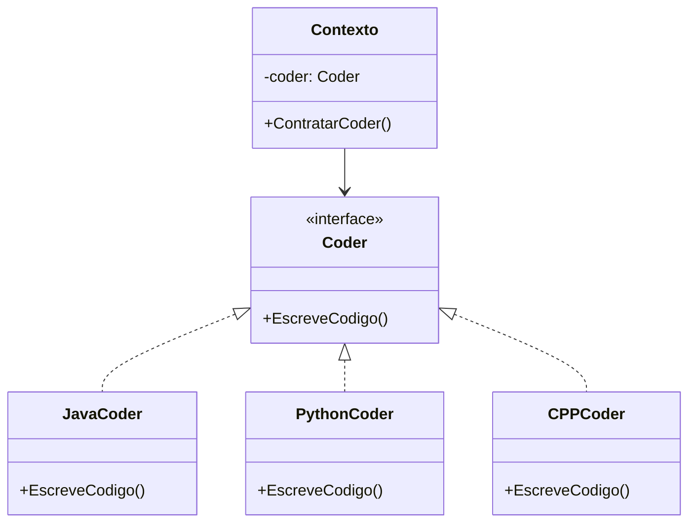

```csharp
public interface Coder {
    void EscreveCodigo();
}

public class JavaCoder : Coder
{
    public void EscreveCodigo()
    {
        Console.WriteLine("Escrevendo código Java...");
    }
}

public class PythonCoder : Coder {
     public void EscreveCodigo()
    {
        Console.WriteLine("Escrevendo código Python...");
    }
}

public class CPPCoder : Coder {
     public void EscreveCodigo()
    {
        Console.WriteLine("Escrevendo código C++...");
    }
}

public class Contexto {
    private Coder coder;

    public Contexto( Coder coder){
        this.coder = coder;
    }

    public void ContratarCoder(){
        coder.EscreveCodigo();
    }
}


class Program{
    static void Main(){
        Contexto contexto = new Contexto(new JavaCoder());
        contexto.ContratarCoder();

        contexto = new Contexto(new PythonCoder());
        contexto.ContratarCoder();

        contexto = new Contexto(new CPPCoder());
        contexto.ContratarCoder();
    }
}
```


```