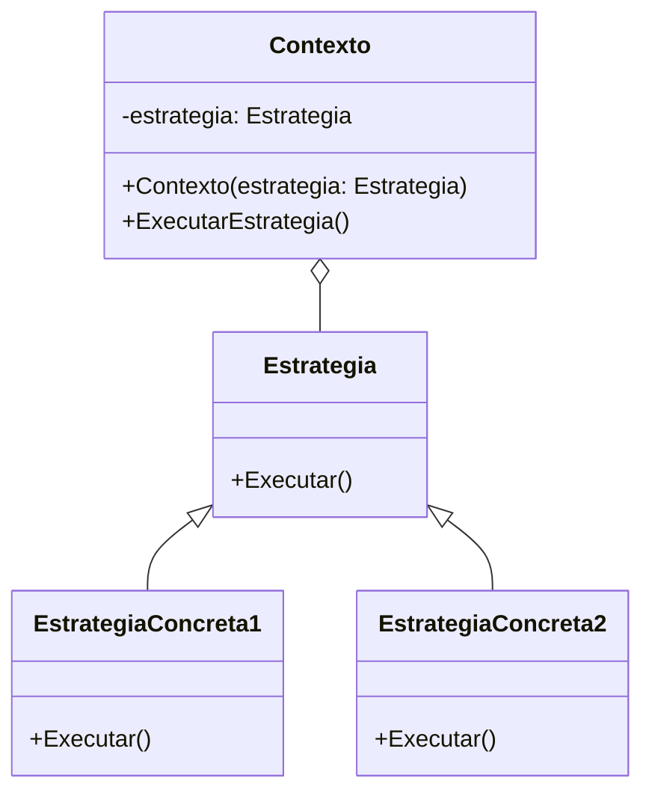

```mermaid
classDiagram
    class Estrategia {
        +Executar()
    }

    class EstrategiaConcreta1 {
        +Executar()
    }

    class EstrategiaConcreta2 {
        +Executar()
    }

    class Contexto {
        -estrategia: Estrategia
        +Contexto(estrategia: Estrategia)
        +ExecutarEstrategia()
    }

    Estrategia <|-- EstrategiaConcreta1
    Estrategia <|-- EstrategiaConcreta2
    Contexto o-- Estrategia
```